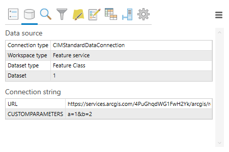
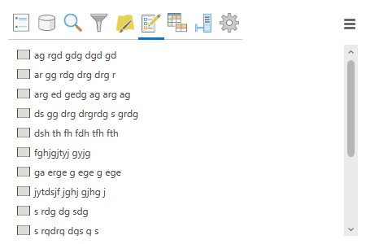

# QuickActions

A productivity-boosting add-in for ArcGIS Pro.

Replaces the context menu of layers and tables in the table of contents with a popup window that provides quick access to common workflows.

## Popup tabs

### Options

Change visibility, selectability, editability and other attributes of the layer that you would normally change on the different tabs in the table of contents.

### Source

Check the data source of the layer.

### Find

Search for features. From the search result list, you can easily select the result features, zoom the map to them, or view and edit their attributes.

### Filter

Change the definition query of the layer.

### Symbology

Quickly symbolize the layer by using a classification field. You can also copy and paste symbols between layers.

### Create

Select a template and start drawing a new feature. If the layer has no templates, the add-in can automatically generate a basic one for you.

### Fields

View a list of the layer's fields. You can also inspect the value lists of fields that use coded value domains.

### Service

Contains links to the layer's source service in REST, Server Manager and Server Admin. You can also stop and start the service, provided the you have the required permissions.

### Definition

View and edit the layer's CIM definition directly. Mostly useful for developers.
